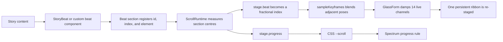
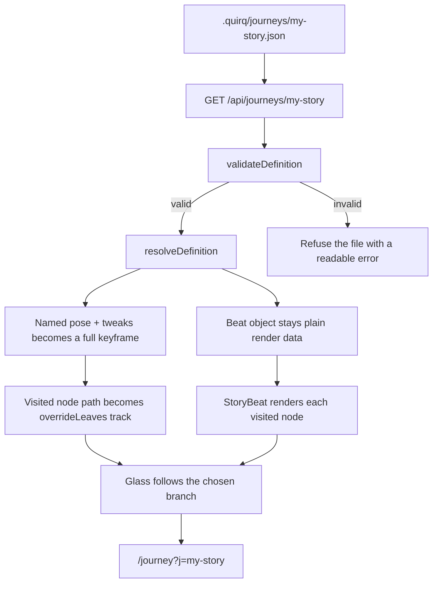

<p align="center">
  
</p>

<h1 align="center">quirq · work at light speed</h1>

<p align="center">
  A cinematic, data-driven Next.js site for the unit of verified agent work.
  <br />
  Tokens meter what agents consume. <strong>quirqs meter what they deliver.</strong>
</p>

<p align="center">
  <a href="https://quirq.ai">Live site</a>
  ·
  <a href="./public/quirq-whitepaper.pdf">Whitepaper</a>
  ·
  <a href="./public/llm.txt">LLM-readable paper</a>
  ·
  <a href="#turn-json-into-a-page">Create a page from JSON</a>
</p>

<p align="center">
  
  
  
  
  
</p>

---

## What this repository is

This is the marketing and research site for [quirq](https://quirq.ai). It is not built as a sequence of disconnected sections. It is one continuous shot:

- A single procedural glass ribbon stays mounted behind the page.
- Each content section registers itself as a **beat**.
- Scroll position becomes a fractional beat such as `1.42`.
- A choreography track blends all 14 pose, optics, and lighting channels.
- The same renderer can turn React components, plain objects, or a branching JSON tree into a staged page.

The visual argument is carried by the glass itself: cost drains toward monochrome; verified delivery restores the full spectrum.

## Contents

- [Experience tour](#experience-tour)
- [Technology](#technology)
- [Quick start](#quick-start)
- [Architecture](#architecture)
- [Repository map](#repository-map)
- [Three ways to author a page](#three-ways-to-author-a-page)
- [Turn JSON into a page](#turn-json-into-a-page)
- [Journey JSON reference](#journey-json-reference)
- [Story beat reference](#story-beat-reference)
- [Scene and glass customization](#scene-and-glass-customization)
- [Brand, content, and UI customization](#brand-content-and-ui-customization)
- [Runtime, performance, and accessibility](#runtime-performance-and-accessibility)
- [Validation and golden testing](#validation-and-golden-testing)
- [Production notes](#production-notes)

## Experience tour

| Route | Purpose | Primary source |
|---|---|---|
| `/` | The main five-beat story: hero, ecosystem, tokens, quirqs, ledger, invite | [`app/page.tsx`](./app/page.tsx), [`components/beats`](./components/beats) |
| `/what-is-quirq` | A focused explainer using the shared stage | [`app/what-is-quirq`](./app/what-is-quirq) |
| `/how-it-works` | The journey JSON authoring manual, rendered by the system it explains | [`app/how-it-works/story.ts`](./app/how-it-works/story.ts) |
| `/beats` | Fractional traversal and the beats-array contract | [`app/beats`](./app/beats) |
| `/scenes` | The 14 scene channels, camera-by-relativity, and pose presets | [`app/scenes/story.ts`](./app/scenes/story.ts) |
| `/dynamic` | A complete example of a page whose middle is plain data | [`app/dynamic/story.ts`](./app/dynamic/story.ts) |
| `/editor` | A live authoring surface for copy, layout, poses, optics, ordering, and JSON export | [`app/editor/editor.tsx`](./app/editor/editor.tsx) |
| `/journey` | A branching page generated from `.quirq/journeys/*.json` | [`app/journey`](./app/journey) |
| `/golden` | The zero-delta visual choreography harness | [`app/golden`](./app/golden), [`lib/golden.ts`](./lib/golden.ts) |
| `/registry` | How beat sections announce themselves at runtime | [`app/registry`](./app/registry), [`lib/beat-registry.ts`](./lib/beat-registry.ts) |
| `/tree` | Cascaded, branchable choreography authoring | [`app/tree`](./app/tree), [`components/stage/choreo-tree.ts`](./components/stage/choreo-tree.ts) |
| `/research` | Research index generated from typed content | [`lib/research.ts`](./lib/research.ts) |
| `/research/[slug]` | Statically generated research articles | [`app/research/[slug]/page.tsx`](./app/research/%5Bslug%5D/page.tsx) |
| `/quirq-whitepaper.pdf` | Static PDF whitepaper | [`public/quirq-whitepaper.pdf`](./public/quirq-whitepaper.pdf) |
| `/llm.txt` | The whitepaper as one machine-readable text file | [`public/llm.txt`](./public/llm.txt) |

## Technology

- **Next.js 16.2.11** with App Router and Turbopack
- **React 19.2.4**
- **Tailwind CSS 4**
- **react-three-fiber 9**, **drei 10**, and **three 0.185**
- **Motion 12** for content entrance choreography
- **Lenis 1.3** for smooth scroll
- TypeScript with the `@/*` root alias

The Three.js scene is client-only and lazily imported. The page shell, copy, and layout can paint before the roughly 1 MB 3D dependency graph arrives.

## Quick start

### Requirements

- Node.js `20.9` or newer
- pnpm
- A browser with WebGL for the live stage; a still-image fallback is included

### Install and run

```bash
pnpm install
pnpm dev
```

Open [http://localhost:3000](http://localhost:3000).

### Production build

```bash
pnpm build
pnpm start
```

No application environment variables are required. The build does need network access the first time `next/font` fetches Inter, Poppins, and JetBrains Mono.

## Architecture

### From scroll to glass



The hot path deliberately avoids React state. `ScrollRuntime` writes fast-changing values into the module-level [`stage`](./lib/stage-store.ts) store; `useFrame` reads them inside the separate react-three-fiber reconciler root.

### From a `.quirq` JSON file to a page



### The three layers

| Layer | Owns | Important files |
|---|---|---|
| Content | Headlines, rows, tiles, calls to action, choices, research | `components/beats/*`, `app/*/story.ts`, `.quirq/journeys/*.json`, `lib/research.ts` |
| Choreography | Beat registration, scroll mapping, pose resolution, interpolation | `lib/beat-registry.ts`, `components/scroll-runtime.tsx`, `components/stage/choreo-tree.ts`, `components/stage/choreography.ts` |
| Rendering | DOM story components, glass mesh, material, lights, overlays | `components/story/*`, `components/ui/*`, `components/stage/*`, `app/globals.css` |

## Repository map

```text
.
├── .quirq/
│   └── journeys/                 JSON-authored branching pages
├── app/
│   ├── api/journeys/             list, read, dev-only write, and recording APIs
│   ├── editor/                   live page and scene editor
│   ├── journey/                  JSON model, resolver, and branching runtime
│   ├── research/                 research index and generated article routes
│   ├── dynamic/                  canonical data-driven page example
│   ├── scenes/                   scene customization guide
│   ├── golden/ registry/ tree/   architecture feature pages
│   ├── layout.tsx                fonts, metadata, motion provider, no-JS fallback
│   ├── page.tsx                  composed home page
│   └── globals.css               design tokens and global visual language
├── components/
│   ├── beats/                    hand-composed home sections
│   ├── story/                    BeatData type and generic StoryBeat renderer
│   ├── stage/                    canvas, mesh, shader, track, and choreography
│   ├── ui/                       primitives, navigation, footer, agent handoff
│   ├── scroll-runtime.tsx        DOM measurement → fractional beat mapping
│   └── stage-page.tsx            shared stage shell
├── lib/
│   ├── beat-registry.ts          runtime beat registration
│   ├── stage-store.ts            allocation-free frame state
│   ├── golden.ts                 dev capture harness
│   ├── lighting.ts               coupled brightness presets
│   ├── research.ts               typed research content
│   └── spectrum.ts               the seven brand colors
├── public/
│   ├── assets/                   favicon, social art, fallback, README banner
│   ├── llm.txt                   machine-readable whitepaper
│   └── quirq-whitepaper.pdf
├── docs/
│   ├── animation.md              deeper animation-system walkthrough
│   └── goldens/                  captured choreography baselines
├── next.config.ts
└── package.json
```

## Three ways to author a page

Choose the lowest level that gives you the control you need.

### 1. Compose custom React beats

Use this when a section needs bespoke markup or interaction. The home page follows this pattern:

```tsx
import { StagePage } from "@/components/stage-page";
import { Hero } from "@/components/beats/hero";
import { Delivery } from "@/components/beats/delivery";

export default function Page() {
  return (
    <StagePage>
      <Hero />
      <Delivery />
    </StagePage>
  );
}
```

Every staged section must render the shared `Beat` primitive or call `registerBeat` directly. A raw section that never registers is invisible to the choreography.

### 2. Render plain `BeatData`

Use this for linear pages whose layout fits the generic renderer:

```tsx
import { StagePage } from "@/components/stage-page";
import { StoryBeat } from "@/components/story/story-beat";
import type { BeatData } from "@/components/story/types";

const STORY: BeatData[] = [
  {
    index: 0,
    id: "intro",
    layout: "center",
    title: ["Your first line,", "made of light."],
    glass: 1,
    lede: "A page can be an array of plain objects.",
  },
  {
    index: 1,
    id: "proof",
    layout: "left",
    marker: "01 · the proof",
    title: ["State in,", "state out."],
    rows: [
      { title: "Capture before.", note: "Record the world before work starts." },
      { title: "Verify after.", note: "Score the actual changed state." },
    ],
  },
];

export default function Page() {
  return (
    <StagePage>
      {STORY.map((beat) => (
        <StoryBeat key={beat.id} data={beat} />
      ))}
    </StagePage>
  );
}
```

Pages that use the repository’s default choreography should have no more than its five resolved leaves. Fewer beats are fine. The editor and journey runtime can exceed five because they provide their own track through `overrideLeaves`.

### 3. Generate a branching page from JSON

Use a `.quirq` journey when content should branch based on visitor choices, or when the page should be transferable as one data object without adding a route component.

The rest of this README focuses on this path.

## Turn JSON into a page

### Fastest path: use the live editor

1. Run `pnpm dev`.
2. Open [http://localhost:3000/editor](http://localhost:3000/editor) on a desktop-sized viewport.
3. Add, remove, or reorder beats.
4. Edit marker, title, lede, alignment, and glass title line.
5. Pick a pose preset or tune any of the 14 channels.
6. Set a kebab-case slug such as `product-tour`.
7. Choose **Copy journey JSON** to copy the complete document.
8. Choose **Create page** in development to write `.quirq/journeys/product-tour.json`.
9. Open `/journey?j=product-tour`.

The editor exports a valid **linear** journey: one node per beat and one forward choice per node. Open the generated JSON afterward to add forks, richer content blocks, or different prompts.

> `Create page` is intentionally development-only. In production, the `.quirq` folder is read-only.

### Hand-authored path

Create `.quirq/journeys/launch-story.json`:

```json
{
  "slug": "launch-story",
  "name": "Launch story",
  "rules": {
    "start": "intro",
    "maxDepth": 2,
    "allowRewind": true,
    "allowReplay": true
  },
  "nodes": {
    "intro": {
      "short": "start",
      "pose": {
        "base": "centre"
      },
      "beat": {
        "layout": "center",
        "title": ["A page from", "one JSON file."],
        "glass": 1,
        "lede": "The copy, the branch, and the glass pose all travel together."
      },
      "prompt": "Where should we go next?",
      "choices": [
        {
          "label": "Show me the proof",
          "to": "proof"
        }
      ]
    },
    "proof": {
      "short": "the proof",
      "pose": {
        "base": "flooded",
        "tweaks": {
          "spin": 0.2,
          "burst": 0.78
        }
      },
      "beat": {
        "layout": "right",
        "marker": "01 · verified",
        "title": ["State changed,", "value proved."],
        "glass": 1,
        "rows": [
          {
            "title": "The page renders from data.",
            "note": "StoryBeat converts this object into the real page."
          },
          {
            "title": "The glass follows the node.",
            "note": "The named pose is resolved and added to the active track."
          }
        ],
        "links": [
          {
            "href": "/what-is-quirq",
            "label": "What is quirq"
          },
          {
            "href": "/quirq-whitepaper.pdf",
            "label": "Read the paper",
            "tone": "ghost"
          }
        ]
      }
    }
  }
}
```

Then:

1. Keep the filename and `slug` identical.
2. Open `http://localhost:3000/journey?j=launch-story`.
3. If the journey library was already open, refresh it with the page’s **Reload .quirq** control.
4. Edit the file and reload to iterate.

No React component, route file, or registry entry is needed.

### Send a definition through the development API

With the dev server running:

```bash
curl -X POST http://localhost:3000/api/journeys \
  -H "content-type: application/json" \
  --data-binary @.quirq/journeys/launch-story.json
```

The API rejects cross-origin browser writes, invalid slugs, missing start nodes, unknown poses, and dangling choice targets. Writes use a temporary file plus rename so readers never observe half-written JSON.

### Generate a linear JSON object programmatically

This plain Node.js example turns a content array into the same shape the editor exports:

```js
const slug = "product-tour";

const pages = [
  {
    short: "start",
    title: ["Meet your", "new workflow."],
    layout: "center",
    pose: "centre",
    lede: "The opening of the generated page."
  },
  {
    short: "the proof",
    title: ["One state,", "then another."],
    layout: "left",
    pose: "flooded",
    lede: "The final node closes the linear walk."
  }
];

const ids = pages.map((_, index) => `b${index + 1}`);

const journey = {
  slug,
  name: "Product tour",
  rules: {
    start: ids[0],
    maxDepth: pages.length,
    allowRewind: true,
    allowReplay: true
  },
  nodes: Object.fromEntries(
    pages.map((page, index) => [
      ids[index],
      {
        short: page.short,
        pose: { base: page.pose },
        beat: {
          layout: page.layout,
          title: page.title,
          lede: page.lede
        },
        ...(index < pages.length - 1
          ? {
              prompt: "Keep walking?",
              choices: [
                {
                  label: pages[index + 1].title.join(" "),
                  to: ids[index + 1]
                }
              ]
            }
          : {})
      }
    ])
  )
};

console.log(JSON.stringify(journey, null, 2));
```

Save the printed object as `.quirq/journeys/product-tour.json`, or POST it to the development API.

## Journey JSON reference

### Top-level document

| Key | Required | Type | Effect |
|---|---:|---|---|
| `slug` | Yes | `string` | Kebab-case identity used by the filename, `?j=` URL, traces, and recordings. Accepted form: `^[a-z0-9-]{1,64}$`. |
| `name` | Yes | `string` | Human-readable label in the journey library. |
| `rules` | Yes | `object` | Opens and constrains the walk. |
| `nodes` | Yes | `Record<string, JourneyNode>` | The complete content and choice graph. |
| `recording` | No | `object` | The last recorded walk. Runtime-managed; normally omit it when authoring. |

### Rules

| Key | Required | Default | Meaning |
|---|---:|---:|---|
| `start` | Yes | — | ID of the opening node; it must exist in `nodes`. |
| `maxDepth` | No | `12` | Maximum number of nodes in an active path. Reaching it ends the walk even if choices remain. |
| `allowRewind` | No | `true` | Enables the visitor to step back through the chosen path. |
| `allowReplay` | No | `true` | Enables recorded transitions and saved traces to replay. |

### Node

| Key | Required | Type | Meaning |
|---|---:|---|---|
| `short` | Yes | `string` | Compact label used in the path trail and saved traces. Two or three words works best. |
| `pose` | Yes | `PoseSpec` | Named glass pose plus optional per-channel overrides. |
| `beat` | Yes | `StoryBeat` object | Everything the visitor sees in this section. `index` and `id` are supplied by the journey runtime. |
| `prompt` | No | `string` | Question shown at the active choice point. |
| `choices` | No | `{ label, to }[]` | Legal outgoing edges. A node without choices is an ending. |

### Choices and branching

```json
{
  "prompt": "What matters most?",
  "choices": [
    {
      "label": "Lower cost",
      "to": "cost"
    },
    {
      "label": "Stronger proof",
      "to": "proof"
    }
  ]
}
```

Every `to` value must name an existing node. Paths restored from URLs or saved traces are accepted only when:

1. the first ID equals `rules.start`;
2. every ID exists;
3. every transition is an actual choice from the previous node; and
4. path length does not exceed `maxDepth`.

This fails closed: stale or edited links do not crash the page or jump across illegal edges.

### Recording

During a walk, the runtime records transitions as full path snapshots:

```json
{
  "recording": {
    "journey": "launch-story",
    "startedAt": 1784992298061,
    "events": [
      {
        "at": 1784992298061,
        "kind": "start",
        "node": "intro",
        "path": ["intro"]
      },
      {
        "at": 1784992302123,
        "kind": "choose",
        "label": "Show me the proof",
        "node": "proof",
        "path": ["intro", "proof"]
      }
    ]
  }
}
```

Event kinds are `start`, `choose`, `rewind`, `loop`, and `replay`. Recordings always persist to `localStorage`; in development they are also written into the journey JSON. Re-saving a definition without a `recording` key preserves an existing recording in the file.

## Story beat reference

The JSON node’s `beat` object uses the same vocabulary as [`BeatData`](./components/story/types.ts), minus runtime-supplied `index` and `id`.

### Core fields

| Key | Required | Values | Result |
|---|---:|---|---|
| `layout` | Yes | `"center"`, `"left"`, `"right"` | Places the copy relative to the glass. |
| `title` | Yes | Exactly two strings | Two separately revealed headline lines. |
| `glass` | No | `0` or `1` | Renders the first or second title line as translucent glass type. |
| `marker` | No | `string` | Mono chapter label with a spectrum chip and rule. |
| `lede` | No | `string` | Supporting paragraph under the headline. |
| `rows` | No | `{ title, note }[]` | Open numbered rows separated by hairlines. |
| `panelRows` | No | `{ title, note }[]` | Numbered rows inside one bordered glass panel. |
| `tiles` | No | `{ label, body }[]` | Stacked labeled tiles inside a panel grid. |
| `code` | No | `string` | Preformatted mono panel. Use `\n` for line breaks in JSON. |
| `caption` | No | `string` | Small mono note below the primary content. |
| `links` | No | `{ href, label, tone? }[]` | Solid or ghost calls to action. Non-journey destinations open in a new tab while walking a journey. |

The renderer can display several content blocks together, but one primary structure per beat—`rows`, `panelRows`, or `tiles`—usually produces the cleanest rhythm.

### Rows

```json
{
  "rows": [
    {
      "title": "Capture before.",
      "note": "Snapshot the state that exists before work starts."
    },
    {
      "title": "Verify after.",
      "note": "Score the changed world, not the agent's own summary."
    }
  ]
}
```

### Panel rows

```json
{
  "panelRows": [
    {
      "title": "Dolly with z.",
      "note": "Positive z approaches the camera; negative z recedes."
    },
    {
      "title": "Change attitude with tilt.",
      "note": "tiltX and tiltZ are absolute targets."
    }
  ]
}
```

### Tiles, code, caption, and links

```json
{
  "tiles": [
    {
      "label": "Pose",
      "body": "x, y, z, scale, spin, tiltX, and tiltZ."
    },
    {
      "label": "Optics",
      "body": "chroma, thickness, distortion, aniso, rough, and ior."
    }
  ],
  "code": "Q = V * B\ncost = tokens + compute + human minutes",
  "caption": "The worker's testimony never enters the ledger.",
  "links": [
    {
      "href": "/research/the-quirq-calculus",
      "label": "Read the calculus"
    },
    {
      "href": "/quirq-whitepaper.pdf",
      "label": "Whitepaper",
      "tone": "ghost"
    }
  ]
}
```

### Layout guidance

- Use `center` for openings, major reveals, and endings.
- Use `left` when the glass is staged to the right or the copy needs more scan depth.
- Use `right` when the pose moves left or a bright spectrum moment should remain visible.
- Keep titles to two deliberate lines; the renderer and reveal timing are built around that tuple.
- Keep each beat close to one viewport. The runtime measures actual centres, but the visual peak still reads best when sections have similar narrative weight.
- Content over live 3D should remain inside `GlassPool` or carry a `TextScrim`. `StoryBeat` handles this automatically.

## Scene and glass customization

### Named poses

A journey pose begins with one of five authored presets:

| JSON value | Source beat | Visual intention |
|---|---|---|
| `"centre"` | Hero | Centred, breathing, balanced spectrum. |
| `"drained"` | Consumption | Right-shifted, rougher, murkier, nearly monochrome. |
| `"flooded"` | Delivery | Left-shifted, highly chromatic, clear, bright. |
| `"recede"` | Ledger | Smaller and far upstage so numbers own the frame. |
| `"finale"` | Invite | Returns to centre, largest and fully lit. |

The spelling is intentionally `"centre"`.

### Pose inheritance

Use a preset unchanged:

```json
{
  "pose": {
    "base": "flooded"
  }
}
```

Or override only what differs:

```json
{
  "pose": {
    "base": "flooded",
    "tweaks": {
      "x": -1.4,
      "z": 0.8,
      "spin": 0.24,
      "chroma": 1.1,
      "burst": 0.82
    }
  }
}
```

`resolvePose` spreads the partial `tweaks` object over the complete preset, so omitted channels remain valid.

### All 14 channels

The ranges below are the live editor’s authored ranges, not hard physical limits.

| Group | Channel | Editor range | What it changes |
|---|---|---:|---|
| Position | `x` | `-4` → `4` | Horizontal subject position. Narrow viewports automatically collapse this toward centre. |
| Position | `y` | `-2` → `2` | Vertical subject position. |
| Position | `z` | `-4` → `3` | Apparent dolly: positive approaches; negative recedes. |
| Position | `scale` | `0.5` → `1.8` | Subject size without changing camera perspective. |
| Attitude | `spin` | `0` → `0.3` | Continuous Y-axis rotation rate in radians per second. |
| Attitude | `tiltX` | `-0.5` → `1.5` | Absolute pitch target. |
| Attitude | `tiltZ` | `-0.8` → `0.8` | Absolute roll target. |
| Optics | `chroma` | `0` → `1.4` | RGB separation; the primary “color equals value” control. |
| Optics | `thickness` | `0.3` → `3` | Refraction depth through the transmission material. |
| Optics | `distortion` | `0` → `1` | Surface distortion strength. |
| Optics | `aniso` | `0` → `0.8` | Directional blur inside the glass. |
| Optics | `rough` | `0` → `0.4` | Surface roughness; higher values soften reflections. |
| Optics | `ior` | `1.1` → `1.9` | Index of refraction. |
| Light | `burst` | `0.1` → `1` | Per-beat intensity before the global lighting gain. |

All channels interpolate with a smoothstep curve and then approach their target with frame-rate-independent damping. That is why even large JSON changes arrive as camera movement rather than cuts.

### Global brightness

Change one line in [`lib/lighting.ts`](./lib/lighting.ts):

```ts
export const LIGHTING: LightingPreset = "max";
```

Available presets:

| Preset | Character |
|---|---|
| `max` | Brightest usable scene with the strongest text scrims. |
| `draft` | Hot core and long rays. |
| `mid` | Similar brightness with a tighter falloff. |
| `soft` | Dimmest, calmest, and most copy-forward. |

The preset couples burst gain, shader core, rays, halo, bloom, environment intensity, backside intensity, and text scrim strength. Change the preset instead of tuning those call sites independently.

### Choreography tree

Published linear stage pages use [`CHOREOGRAPHY`](./components/stage/choreo-tree.ts). The tree:

1. starts from a complete root keyframe;
2. cascades partial overrides down the hierarchy;
3. prunes nodes whose `when` predicate fails;
4. flattens remaining leaves depth-first; and
5. keeps leaf IDs for safe section-to-pose binding.

Example responsive branch:

```ts
const branch = {
  id: "detail",
  when: ({ width }: { width: number }) => width >= 900,
  keyframe: {
    x: 2.2,
    scale: 1.05,
  },
};
```

The resolver runs on mount and resize, never per frame.

### Ribbon geometry

Edit defaults in [`components/stage/ribbon-geometry.ts`](./components/stage/ribbon-geometry.ts):

| Option | Default | Effect |
|---|---:|---|
| `radius` | `2.2` | Radius of the closed loop. |
| `width` | `0.6` | Width of the broad refracting face. |
| `thickness` | `0.22` | Physical mesh depth, separate from material refraction thickness. |
| `segments` | `512` | Smoothness around the loop. |
| `twists` | `2` | Whole cross-section rotations; integers close the seam. |
| `wave` | `0.5` | Vertical saddle amplitude. |
| `waveFreq` | `2` | Vertical oscillations per revolution. |

The mesh is built as four separate quad strips so long edges stay crisp and throw sharp caustics.

### Camera and environment

- Camera: `[0, 0, 9]`, field of view `38` in [`scene.tsx`](./components/stage/scene.tsx).
- Spectrum emitters: [`spectrum-env.tsx`](./components/stage/spectrum-env.tsx).
- Shader burst and parallax: [`light-burst.tsx`](./components/stage/light-burst.tsx).
- Transmission material: [`glass-form.tsx`](./components/stage/glass-form.tsx).
- Seven brand colors: [`lib/spectrum.ts`](./lib/spectrum.ts).

The camera is intentionally fixed. Apparent truck, pedestal, dolly, zoom, and attitude changes come from moving the subject, keeping DOM copy, scrims, and the 3D stage spatially coherent.

## Brand, content, and UI customization

### Customization map

| What to change | File | Notes |
|---|---|---|
| Site name, description, canonical URL, social metadata | [`app/layout.tsx`](./app/layout.tsx) | Update `metadataBase`, titles, descriptions, Open Graph, and Twitter fields together. |
| Fonts | [`app/layout.tsx`](./app/layout.tsx) | Poppins is the mark, Inter is reading text, JetBrains Mono is metered/system copy. |
| Core colors, typography scale, grain, vignette | [`app/globals.css`](./app/globals.css) | Tailwind 4 tokens live in `@theme`; the CSS spectrum is also defined here. |
| Runtime spectrum emitters | [`lib/spectrum.ts`](./lib/spectrum.ts) | Keep this seven-color array synchronized with the CSS `--spectrum` gradient. |
| Global scene brightness | [`lib/lighting.ts`](./lib/lighting.ts) | Prefer the four presets. |
| Home narrative and CTA sections | [`components/beats`](./components/beats) | Bespoke React composition. |
| Data-driven page narrative | Any `app/*/story.ts` | Plain `BeatData[]`, mapped through `StoryBeat`. |
| Branching/generated pages | [`.quirq/journeys`](./.quirq/journeys) | One transferable JSON document per journey. |
| Navigation links and active-route rules | [`components/ui/nav.tsx`](./components/ui/nav.tsx) | Add stage routes to `onStage` so nav timing and treatment stay correct. |
| Early-access email and agent handoff targets | [`components/ui/open-in.tsx`](./components/ui/open-in.tsx) | Update `MAIL`, `PROMPT`, and `TARGETS`. |
| Footer | [`components/ui/footer.tsx`](./components/ui/footer.tsx) | Shared across long-form routes. |
| Research posts | [`lib/research.ts`](./lib/research.ts) | Add one typed object; index and static params update automatically. |
| Favicon and social art | [`public/assets`](./public/assets) | Metadata currently expects `favicon.svg`, `quirq-mark.jpg`, and `og.jpg`. |
| Whitepaper files | [`public/quirq-whitepaper.pdf`](./public/quirq-whitepaper.pdf), [`public/llm.txt`](./public/llm.txt) | Keep human- and machine-readable versions aligned. |

### Research content

Research blocks support:

- `h2`
- `h3`
- `p`
- `quote`
- `code`
- `table`
- `list`

Add a new object to `POSTS` in [`lib/research.ts`](./lib/research.ts). `generateStaticParams` creates the route automatically, and the index reads from the same source.

### Navigation

When adding a new stage page:

1. render it inside `StagePage`;
2. add its path to `onStage` in `Nav`;
3. use the `Beat` primitive or `StoryBeat`;
4. ensure its section IDs align with choreography leaf IDs when using conditional branches; and
5. add a footer base gradient if the final glass pose would sit behind footer copy.

### Static assets

Anything under `public` is served from `/`:

```text
public/assets/og.jpg     → /assets/og.jpg
public/llm.txt           → /llm.txt
public/quirq-whitepaper.pdf → /quirq-whitepaper.pdf
```

Use optimized production formats and keep social images at a platform-friendly aspect ratio. The README banner is [`public/assets/readme-banner.png`](./public/assets/readme-banner.png).

## Runtime, performance, and accessibility

### Performance behavior

- Three.js, drei, and the shaders are dynamically imported with `ssr: false`.
- The static page and typography paint before WebGL is ready.
- Small viewports or machines with four or fewer logical cores use:
  - `3` transmission samples;
  - `256` environment resolution; and
  - no backside refraction.
- Larger machines use:
  - `8` samples;
  - `512` environment resolution; and
  - backside refraction.
- Environment lights bake once with `frames={1}`.
- The per-frame sampler reuses objects and iterates a static exhaustive channel list.
- The glass geometry is created once and disposed on unmount.

### Responsive behavior

- Horizontal choreography collapses toward centre on narrow aspect ratios.
- Scale receives an automatic mobile fit factor.
- Beat centres are measured from real DOM geometry, not assumed `100vh` multiples.
- Font loading, resize, beat registration, addition, removal, and reordering all trigger re-measurement.

### Reduced motion

When `prefers-reduced-motion: reduce` is active:

- Lenis is skipped in favor of native scrolling.
- Stage damping effectively snaps to targets.
- Pointer parallax, breathing, and sway are disabled.
- Motion’s provider respects the user preference.

### No WebGL and no JavaScript

- Without WebGL, the live scene falls back to `/assets/mobius.jpg`.
- Without JavaScript, the layout’s `<noscript>` styles remove initial animation opacity and transforms so content remains readable.
- The nonfunctional agent-menu chevron is hidden without JavaScript while its email action remains usable.

### Readability and keyboard behavior

- Text over the live stage uses local scrims instead of a frame-wide opaque layer.
- Small faint text is set to meet AA contrast on black.
- Focus-visible rings are globally defined, with an inverse treatment for ink-filled controls.
- Scrollable code and table regions are keyboard-focusable.
- External links announce that they open in a new tab.

## Validation and golden testing

### Journey validation

[`validateDefinition`](./app/journey/defs.tsx) checks:

- the definition is an object;
- the slug is valid;
- a name and nodes map exist;
- `rules.start` names a node;
- every node has `short`, a title, and a known pose; and
- every choice target exists.

The loader validates again on the client before resolving the definition.

### Type and production checks

```bash
pnpm build
```

The Next.js build performs TypeScript checking and route generation. There is currently no standalone `lint` or unit-test script in `package.json`.

### Golden choreography capture

In development, stage pages expose:

```js
const capture = await window.__golden(21);
```

The harness records:

- measured section centres;
- fractional `stage.beat` at 21 scroll stops; and
- all 14 sampled channels at each stop.

Baselines live under [`docs/goldens`](./docs/goldens). The intended migration gate is exact zero delta, not visual approximation. This protects the shot while internals such as the registry or choreography tree change.

## Production notes

- The standard production path is `pnpm build` followed by `pnpm start`, or a Vercel Next.js deployment.
- Keep the project root pointed at the directory containing this `package.json`, `app`, and `next.config.ts`.
- Do not set a custom static output directory; this is a Next.js application with route handlers, not an exported `dist` folder.
- Journey reads are runtime route-handler operations.
- Journey writes and recording writes return `405` outside development. To publish a new journey, add its JSON file to the repository and deploy it with the application.
- There are no required secrets or server environment variables.

## Design invariants

These rules are load-bearing:

1. **One glass object, never remounted between beats.**
2. **Registered sections drive the stage; an unregistered section is not a beat.**
3. **Beat IDs are identity, especially when choreography branches can be pruned.**
4. **Brightness changes through the coupled lighting preset.**
5. **Text over live 3D carries a `GlassPool` or `TextScrim`.**
6. **Fixed, complete geometry beats clipped marquees and sliced grids.**
7. **Sections stay close to one viewport of narrative weight.**
8. **Reduced-motion, no-WebGL, and no-JavaScript paths stay usable.**
9. **The hot frame loop remains allocation-free and outside React state.**
10. **Refactors of the shot are golden-captured and compared.**

---

<p align="center">
  <strong>One shell. One ribbon. Infinite middles.</strong>
  <br />
  Start with <a href="http://localhost:3000/editor"><code>/editor</code></a>,
  export a journey, and let one JSON object become the page.
</p>
